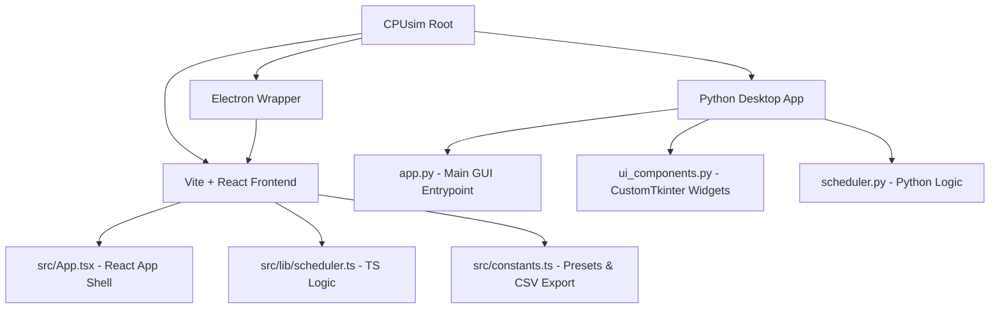

# CPUsim — CPU Scheduling Simulator

CPUsim is a modern, high-fidelity, hybrid CPU Scheduling Simulator. It allows computer science students and system engineers to visualize, analyze, and compare various CPU scheduling algorithms in real-time.

The application features a hybrid architecture, offering both a **gorgeous dark-themed Web App** (built with React, TypeScript, and Vite, wrapped in Electron for cross-platform desktop deployment) and a **native Python Desktop App** (built with CustomTkinter and Matplotlib).

---

## 📌 Features

- **Interactive Gantt Chart**: Watch processes execute tick-by-tick with playback controls (play, pause, step forward, step backward, reset, and speed multipliers).
- **Dual-Engine Implementation**: Identical scheduling logic written in both TypeScript (`src/lib/scheduler.ts`) and Python (`scheduler.py`).
- **Comprehensive Metrics**: Computes Waiting Time (WT), Turnaround Time (TAT), Response Time (RT), CPU Utilization, Throughput, and Context Switch count.
- **Live Algorithm Comparison**: Real-time side-by-side comparison chart analyzing average Turnaround Time and Waiting Time across all algorithms.
- **Process Workload Presets**: Test standard scheduling behaviors using predefined workloads:
  - **Default**: A balanced, general workload.
  - **CPU Bound**: Heavy computation processes.
  - **I/O Bound Mix**: Rapid, short burst processes.
  - **Equal Burst**: Processes with matching burst times arriving together.
  - **Heavy Load**: A large number of processes testing preemptive algorithms.
- **CSV Data Export**: Export the full quantitative analysis of the scheduling results to a CSV file for external reporting or spreadsheets.
- **Procedural Workload Generator**: Generate random workloads at the click of a button.

---

## ⚙️ Supported Algorithms

### 1. First-Come, First-Served (FCFS)
* **Type**: Non-Preemptive
* **Logic**: Allocates the CPU to processes in the exact order of their arrival.
* **Pros/Cons**: Simple to implement but susceptible to the **Convoy Effect**, where short processes are forced to wait behind long CPU-bound processes.

### 2. Shortest Job First (SJF)
* **Type**: Non-Preemptive
* **Logic**: Selects the process with the smallest execution burst time from the pool of arrived processes.
* **Pros/Cons**: Mathematically optimal for minimizing average waiting times, but requires advance knowledge of burst times and can cause starvation for longer processes.

### 3. Shortest Remaining Time First (SRTF)
* **Type**: Preemptive (also known as Preemptive SJF)
* **Logic**: At every clock tick, the CPU is allocated to the process with the shortest remaining execution time.
* **Pros/Cons**: Extremely responsive with low average wait times, but incurs a higher context-switching overhead.

### 4. Priority Scheduling
* **Type**: Non-Preemptive
* **Logic**: The CPU is allocated to the process with the highest priority (where a lower number denotes a higher priority).
* **Pros/Cons**: Essential for real-time systems but can lead to **starvation** for low-priority processes.

### 5. Round Robin (RR)
* **Type**: Preemptive
* **Logic**: Each process is allocated a fixed time slice (Time Quantum). When the quantum expires, the process is preempted and returned to the tail of the ready queue.
* **Pros/Cons**: Ensures fair sharing of the CPU and excellent response times, but performance is highly dependent on the chosen Time Quantum.

### 6. Multi-Level Feedback Queue (MLFQ)
* **Type**: Preemptive
* **Logic**: Employs three distinct queues ($Q_0, Q_1, Q_2$) with decreasing priorities and increasing time slices. Processes that exhaust their time quantum in $Q_0$ are demoted to $Q_1$, and then to $Q_2$ (which acts as FCFS).
* **Pros/Cons**: Dynamically adapts to separate CPU-bound and I/O-bound processes, balancing responsiveness with system throughput.

---

## 📊 Evaluation Metrics

$$\begin{aligned}
\text{Turnaround Time (TAT)} &= \text{Completion Time (C)} - \text{Arrival Time (A)} \\
\text{Waiting Time (WT)} &= \text{Turnaround Time (TAT)} - \text{Burst Time (B)} \\
\text{Response Time (RT)} &= \text{First Execution Time} - \text{Arrival Time (A)}
\end{aligned}$$

- **CPU Utilization (%)**: The percentage of total simulation time during which the CPU was actively executing a process (not in the `IDLE` state).
- **Throughput**: The number of processes completed per unit time ($P_{\text{total}} / T_{\text{total}}$).
- **Context Switches**: The number of times the processor switches from executing one process to another (consecutive execution of the same process and transitions to/from `IDLE` are not counted).

---

## 🛠️ Project Structure & Architecture



- `src/lib/scheduler.ts` & `scheduler.py`: The simulation engines. They compute the Gantt execution logs and compile process metrics.
- `src/App.tsx` & `app.py`: The application entrypoints that orchestrate state changes, run simulations, update sliders, and manage graphs.
- `ui_components.py`: A collection of reusable styling components for CustomTkinter (e.g., headers, sidebars, cards).
- `electron/main.cjs`: Configures Electron to package the React frontend into an installer or desktop application.

---

## 🚀 How to Run the Applications

### Prerequisites
- [Node.js](https://nodejs.org/) (for Web/Electron)
- [Python 3.8+](https://python.org/) (for Python Desktop App)

---

### Running the Web/Electron App

1. **Install Dependencies**:
   ```bash
   npm install
   ```

2. **Run in Development (Browser)**:
   ```bash
   npm run dev
   ```
   Open `http://localhost:3000` in your browser.

3. **Run in Development (Electron)**:
   ```bash
   npm run electron:dev
   ```

4. **Build Production Desktop App Packages**:
   ```bash
   npm run electron:build
   ```

---

### Running the Python Desktop App

1. **Install Python Dependencies**:
   ```bash
   pip install customtkinter matplotlib numpy pillow
   ```

2. **Run the Application**:
   ```bash
   python app.py
   ```

---

## 📝 License
This project is licensed under the MIT License - see the LICENSE file for details.
